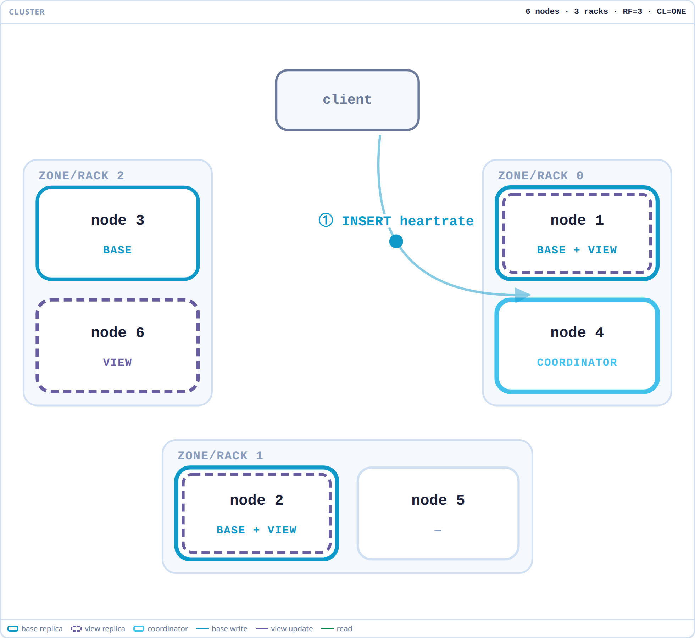

# ScyllaDB Materialized Views & Secondary Indexes

An interactive, single-file visualization of the four ways ScyllaDB can answer the same
question — *"give me the rows for a column that isn't the partition key"* — built as a
big-screen companion to the Advanced Data Modeling deck.

Every mode is shown on three surfaces at once:

- **the CQL** that defines it, with the statement currently executing highlighted,
- **the base table and the table derived from it**, so the reordered primary key is visible
  rather than described,
- **the cluster**, where a write and a read animate hop by hop across coordinator, base
  replicas, and view replicas, grouped into the racks they actually sit in.

*Materialized View mode, step ① of the write path: node 4 is coordinating, nodes 1 and 2 hold
both a base and a view replica, node 3 is base-only and node 6 view-only. The three base
replicas sit one per rack — that spread is what RF=3 is for, and the reason the nodes are drawn
inside their racks rather than on a ring.*

**Disclaimer:** An independent, educational visualization — not an official ScyllaDB product
and not behaviorally exact. Not affiliated with or endorsed by ScyllaDB, Inc.

## The four modes

| Mode | Derived table | Write path | Read path |
| --- | --- | --- | --- |
| **Materialized View** | `heartrate_by_owner`, `PRIMARY KEY (owner, pet_chip_id, time)`, all columns carried | coordinator → base replicas → paired view replicas | one hop to a view replica, full rows come back |
| **Global Index** | `pet_by_owner_index`, `PRIMARY KEY (owner, idx_token, pet_chip_id, time)`, keys only | same as MV | index lookup, **then** a second round-trip to the base partitions |
| **Local Index** | `hr_local_index`, `PRIMARY KEY (pet_chip_id, heart_rate, time)` | view update never leaves the node — base and view replicas coincide | one replica answers the whole query |
| **ALLOW FILTERING** | none | nothing at all | every node scans every partition |

## Smart vs non-smart driver

The **Driver** radio in the control bar changes who the client talks to first. It defaults to
**non-smart**, because the hop it adds is most of what the cluster panel is showing.

- **Non-smart** — the client has no idea which node owns which token, so it sends the request
  to a node that happens to own nothing relevant. That node coordinates: it forwards to the
  replicas and collects the answers. Every path pays one extra hop out and one back.
- **Smart** (token-aware) — the client hashes the partition key itself and sends the request
  straight to a replica that owns it. That replica coordinates its own request, so the
  coordinator hop and its reply stop being network traffic and become work inside one node —
  drawn as the same local loop the Local Index write path already uses.

Where the smart driver lands depends on which partition the statement actually addresses:
the base partition for an INSERT, the view for a Materialized View read, the index partition
for a Global Index read, the base partition again for a Local Index read.

Two results are worth pausing on:

- **ALLOW FILTERING is unchanged.** There is no partition to route to, so knowing the ring
  buys the client nothing — the scan still touches every node either way.
- **A Global Index still pays its second round-trip.** The smart driver removes the hop to
  the index, but the base-partition fetch that follows is inherent to the index, not to the
  driver. Local Index under a smart driver is the one case where a single node does everything.

Watching the same INSERT under Local Index and then Global Index is the clearest way to see
what "local" buys: the same three nodes light up as `BASE + VIEW`, and step ③ becomes a loop
inside each node instead of a network hop.

## Fidelity notes

The derived schemas follow ScyllaDB's own construction rather than being invented:

- `index/secondary_index_manager.cc::create_view_for_index()` — a global index puts the
  indexed column in the view's partition key and prepends a computed `idx_token` clustering
  column; a local index keeps the base partition key and puts the indexed column first in the
  clustering key. That's why the index rows in Global Index mode sort by token, not by chip.
- `db/view/view.cc` — each base replica ships its view update to one specific *paired* view
  replica, which is why the write path fans out and then pairs up rather than broadcasting.

Simplifications: 6 nodes across 3 racks, RF=3, CL=ONE, rack-aware replica placement in the
spirit of `NetworkTopologyStrategy` but without datacenters, no failures, no repair or view
building, a stand-in hash where murmur3 would be, and short readable keys instead of UUIDs.
The smart driver is modelled as token-awareness only — it always lands on the first replica,
with no shard awareness, no load-based replica choice and no retry policy.

## Using it

**Live: [tzach.github.io/scylladb-mv-viz](https://tzach.github.io/scylladb-mv-viz/)**

Static and dependency-free — open `index.html` in a browser, or clone and open it locally.
No build step, no server.

| Key | Action |
| --- | --- |
| `1` `2` `3` `4` | switch mode |
| `I` | run the write path (INSERT) |
| `S` | run the read path (SELECT) |
| `R` | reset the data |
| `D` | toggle smart / non-smart driver |

The **Speed** slider covers 0.25×–4×; slow it down to narrate a step, speed it up to move on.
The **Theme** button cycles system / light / dark.

## Credits

Styled with the ScyllaDB design system (`scylladb-ds.css`), shared with
[scylladb-ha-demo](https://github.com/tzach/scylladb-ha-demo).
